<div align="center">

# OLion

**OLion**: Approaching the Hadamard Ideal by Intersecting Spectral and ℓ∞ Implicit Biases

</div>

<div align="center" style="line-height: 1;">
    <a href="https://arxiv.org/abs/2602.01105" target="_blank">
    </a>
    <a href="https://github.com/kv-wang/OLion" target="_blank">
    </a>
</div>

<br>

## News

- **[2026/2/10]** We release our paper [OLion: Approaching the Hadamard Ideal by Intersecting Spectral and ℓ∞ Implicit Biases](https://arxiv.org/abs/2602.01105) (arXiv:2602.01105) and open-source the code.

---

## Paper Overview

**OLion (Orthogonal Lion)** is a memory-efficient optimizer that combines two complementary implicit biases in a single update:

1. **Spectral control** (from **Muon**): orthogonalizing the update direction via Newton–Schulz iterations, yielding a flattened singular-value profile and bounded spectral norm.
2. **ℓ∞-style coordinate control** (from **Lion**): applying an element-wise sign to the direction, capping each coordinate’s contribution and promoting uniform entrywise magnitudes.

For matrix-shaped parameters, the intersection of these two geometries corresponds to a **scaled Hadamard-like set** (orthogonal columns with entries ±1/√d). OLion approximates this intersection by **first orthogonalizing the Lion-style momentum direction, then taking its entrywise sign**, plus optional RMS scaling for stable step sizes. As a result, it keeps Muon’s memory efficiency (momentum-level state only) while adding the benefits of sign-based updates.

**Highlights:**

- **Theory**: Convergence is established under a mild diagonal-isotropy assumption on the update signal (empirically verified).
- **Practice**: OLion matches or outperforms AdamW and Muon on GPT-2 and Llama pretraining, SiT image pretraining, and Llama supervised fine-tuning, and **reduces optimizer mismatch** when fine-tuning AdamW-pretrained checkpoints (e.g., Llama-3.1-8B).
- **Systems**: Sign updates enable communication-efficient (e.g., 1-bit) distributed training and are friendly to low-precision quantization.

### Geometry Motivation

The figure below illustrates how Muon and Lion correspond to maximal updates under two norm-induced geometries; OLion seeks an update direction that lies near their intersection (Hadamard as an idealized reference).

<div align="center">
  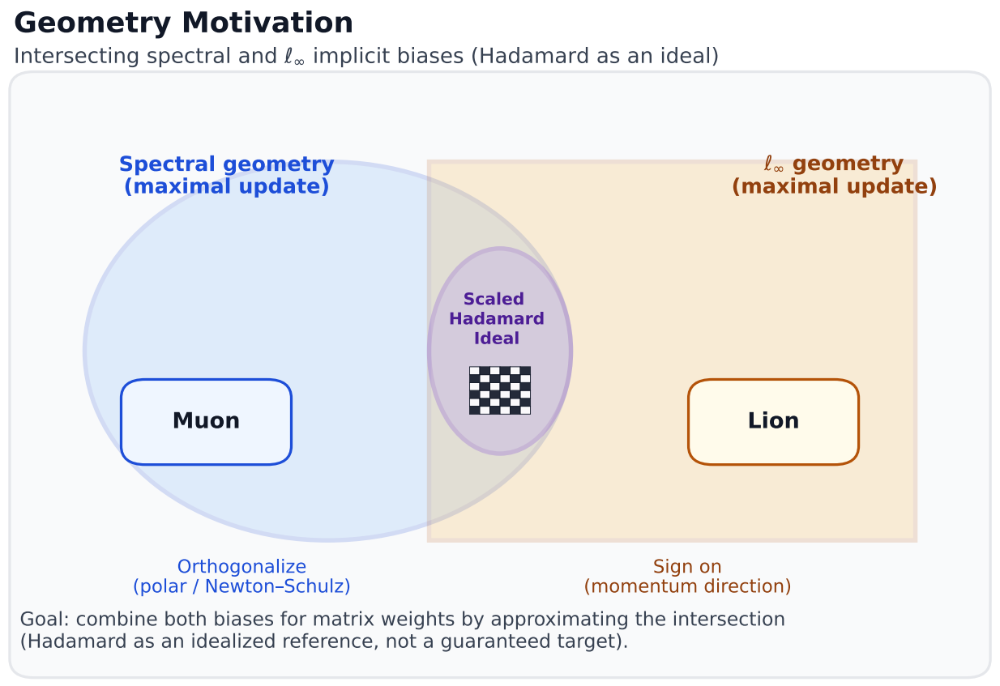
</div>

### Implicit Bias: Spectral and ℓ∞ Norms

OLion induces both small spectral norm and small ℓ∞ norm during training, while AdamW and Lion favor mainly one or the other. Below: evolution of spectral norm and ℓ∞ norm for representative weight matrices in GPT-2 small pretraining.

| Spectral norm (768×768) | Spectral norm (3072×768) |
|-------------------------|--------------------------|
| 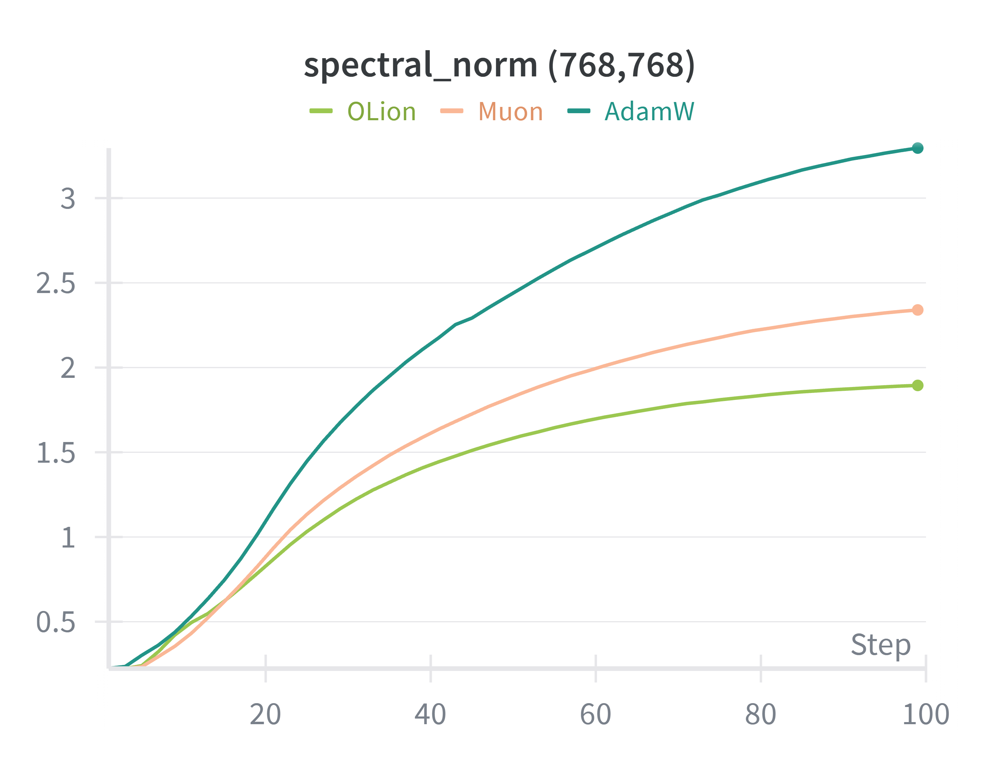 | 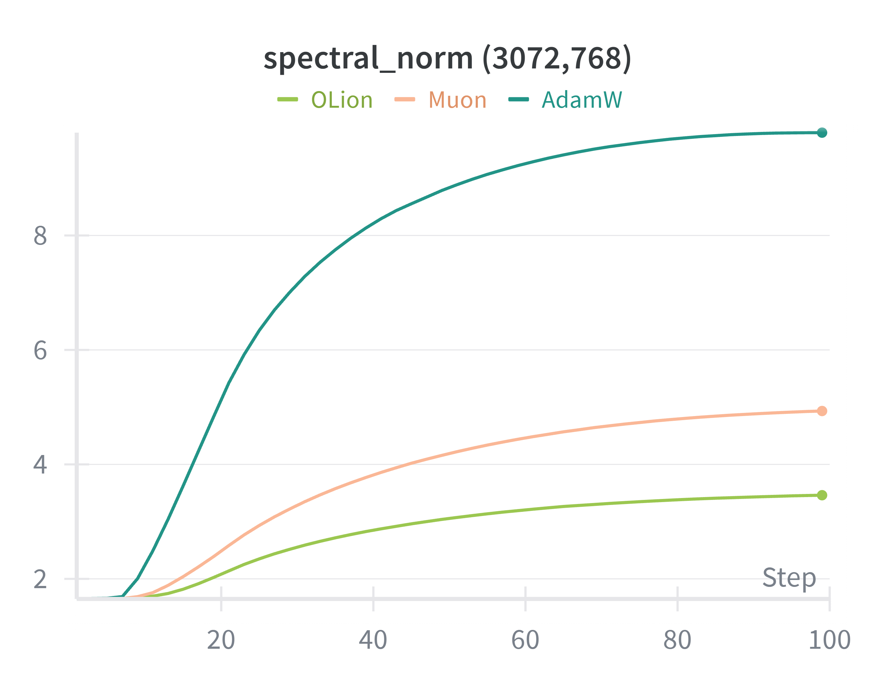 |

| ℓ∞ norm (768×768) | ℓ∞ norm (3072×768) |
|-------------------|---------------------|
| 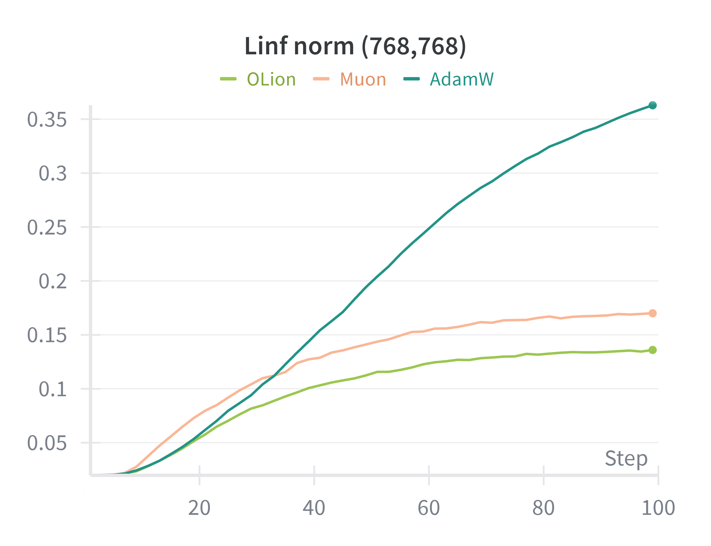 | 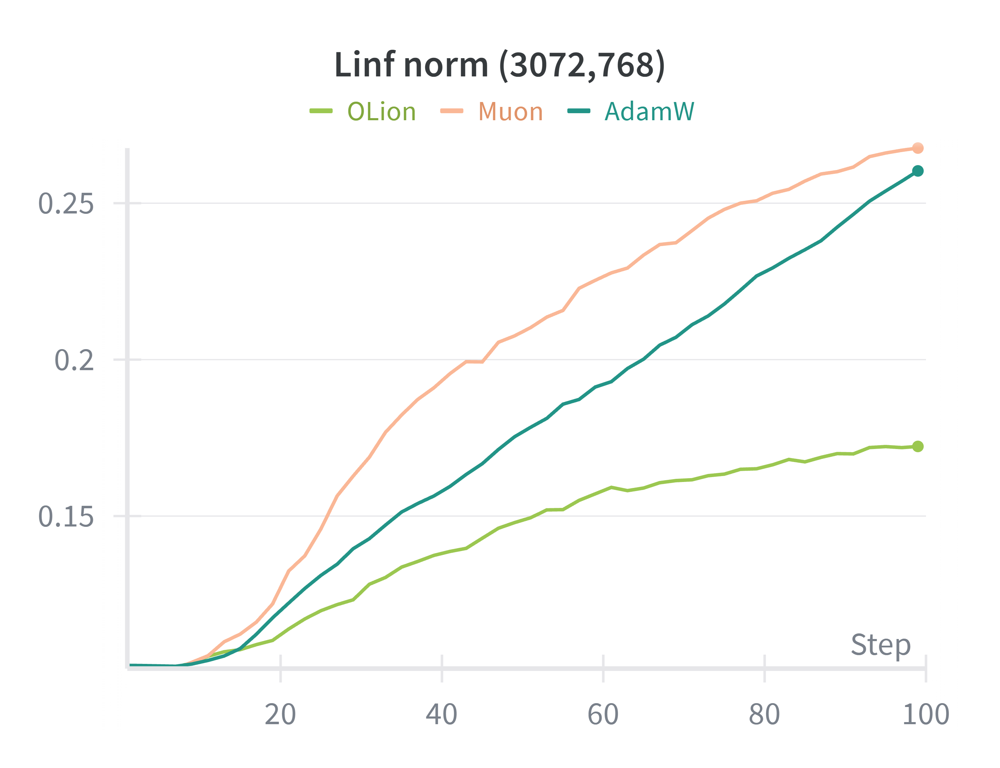 |

---

## Overview

We introduce **OLion (Orthogonal Lion)**, an efficient and effective optimizer that:

- Combines **spectral control** from orthogonalized update directions (Muon-style) with **ℓ∞-style coordinate control** from sign updates (Lion-style).
- Uses only **momentum-level optimizer state**, matching the memory footprint of Lion/Muon.
- Improves **pretraining** (GPT-2, Llama-2-7B, SiT) and **supervised fine-tuning** (e.g., Llama-3.1-8B on math/reasoning benchmarks), and mitigates **optimizer mismatch** when fine-tuning AdamW-pretrained models.

---

## Getting Started

### Installation & Training Scripts

#### nanoGPT Setup

To run **nanoGPT** experiments:

```bash
cd nanoGPT
conda create -n nanogpt python=3.10
pip install torch numpy transformers datasets tiktoken wandb tqdm
```

#### Llama Setup

To run **Llama-2-7B pretraining**:

```bash
cd Llama
conda env create -f environment.yml
pip install -r requirements.txt
python -m pip install --pre torch torchvision torchaudio --index-url https://download.pytorch.org/whl/nightly/cu121
```

#### SiT Pretraining Setup

Please refer to the [REPA](https://github.com/sihyun-yu/REPA) repository.

---

### Running Experiments

#### nanoGPT (GPT-2) Training

We use the OpenWebText dataset. Train GPT-2 with OLion:

```bash
cd nanoGPT
bash run.sh
```

You can change the optimizer, batch size, learning rate, and model scale in `run.sh`. Example validation loss curves (OLion vs baselines):

| GPT-2 Small (124M) | GPT-2 Medium (355M) | GPT-2 Large (770M) |
|--------------------|---------------------|---------------------|
| 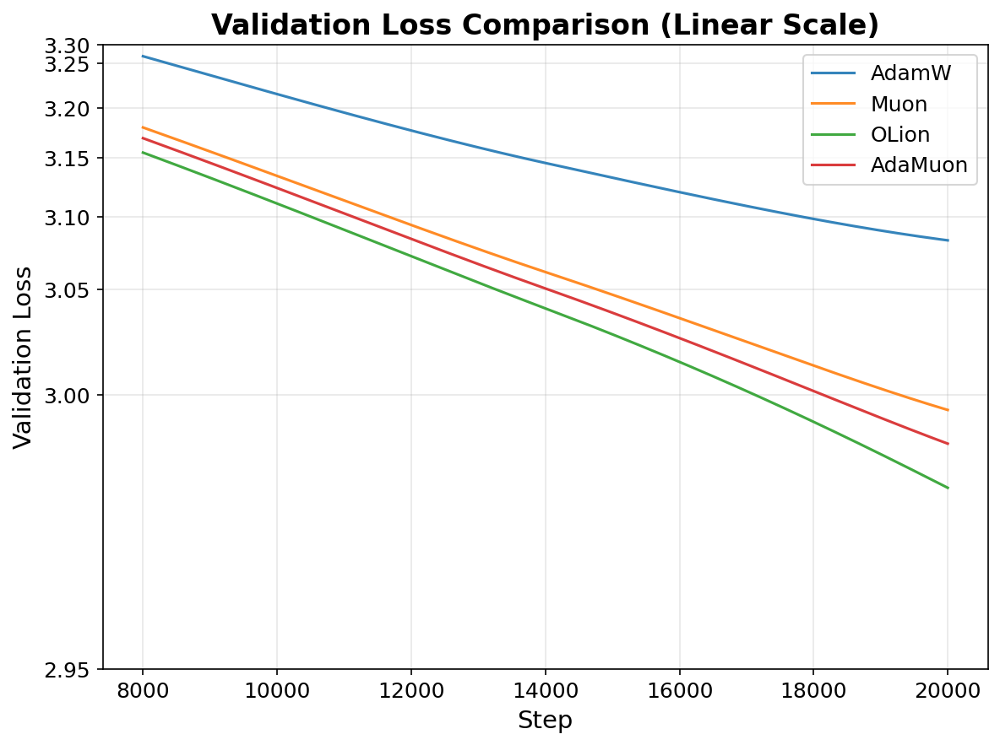 | 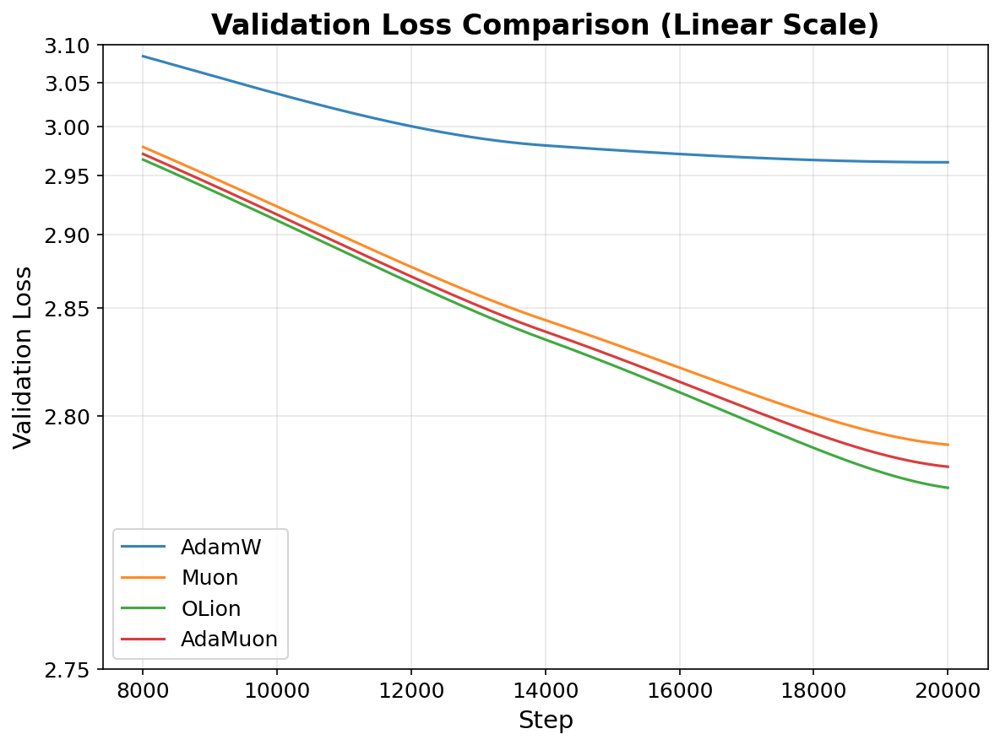 | 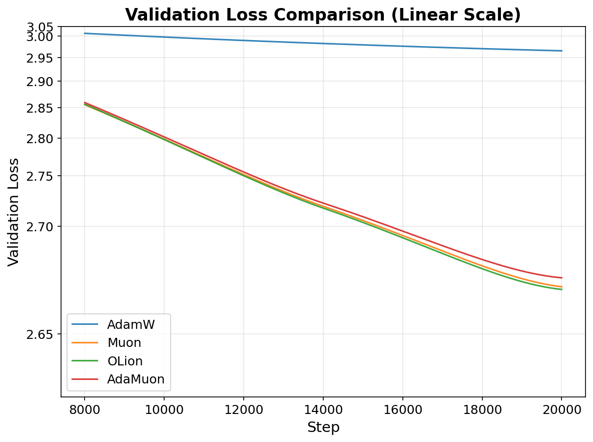 |

#### Llama-2-7B Pretraining

To run Llama-2-7B pretraining with OLion:

```bash
cd Llama
bash run_llama_2_7b.sh
```

Training configurations (optimizer, learning rate, batch size, dataset, etc.) can be edited in `Llama/train_configs/llama2_7b.toml`.

| Training loss | Validation loss |
|---------------|------------------|
| 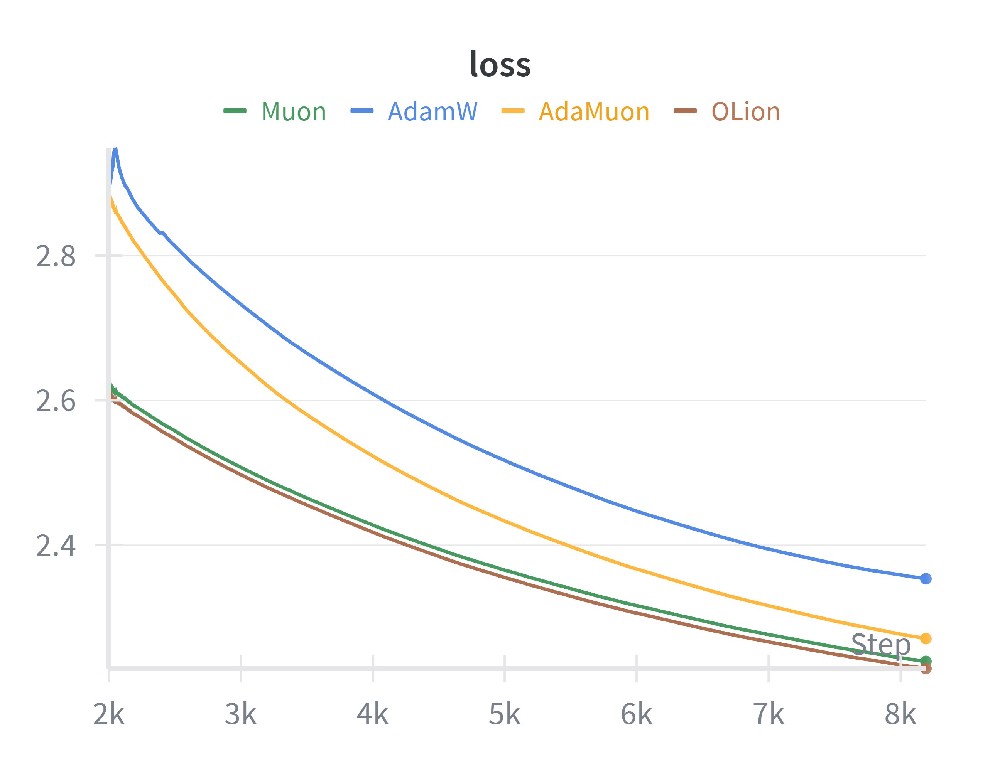 | 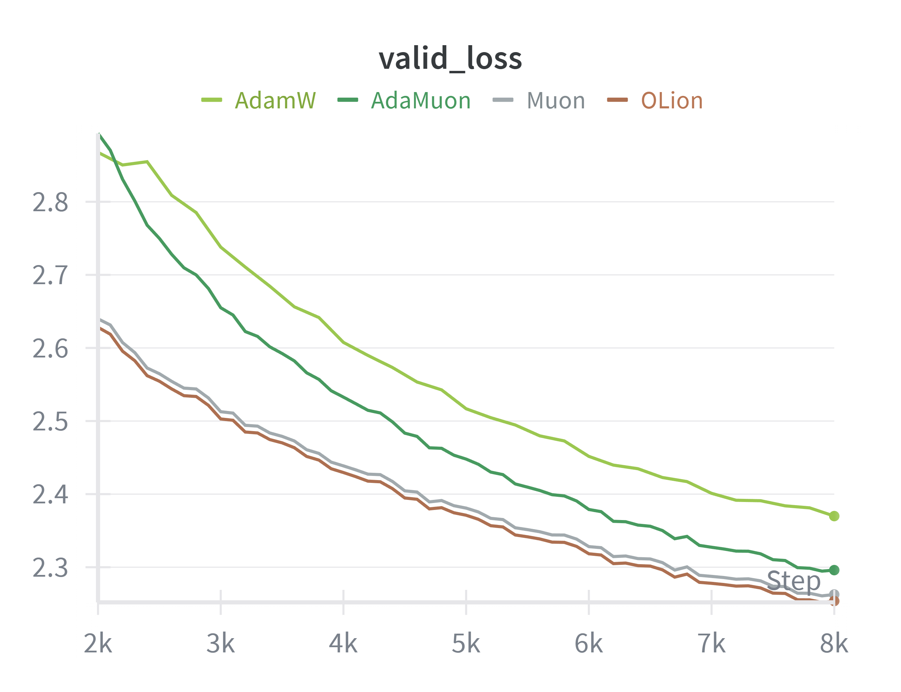 |

#### SiT-B/2 Image Pretraining

To run SiT-B/2 pretraining with OLion:

```bash
cd SIT
bash run.sh
```

Modify settings in `SIT/run.sh` as needed.

| Projection loss | Denoising loss |
|-----------------|----------------|
| 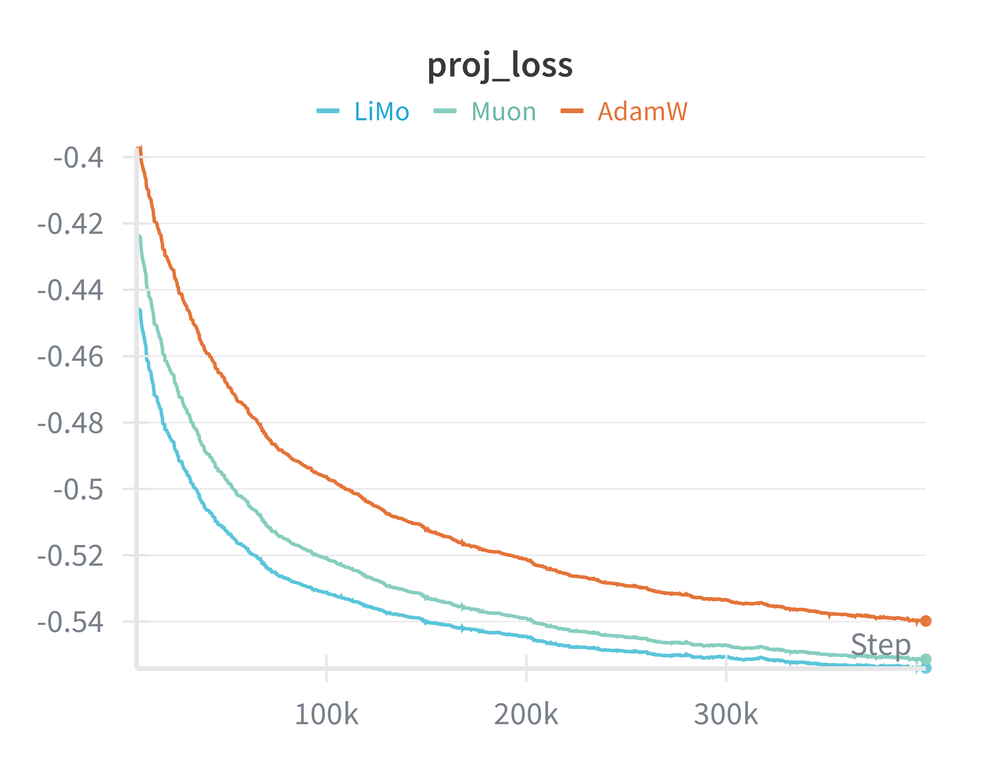 | 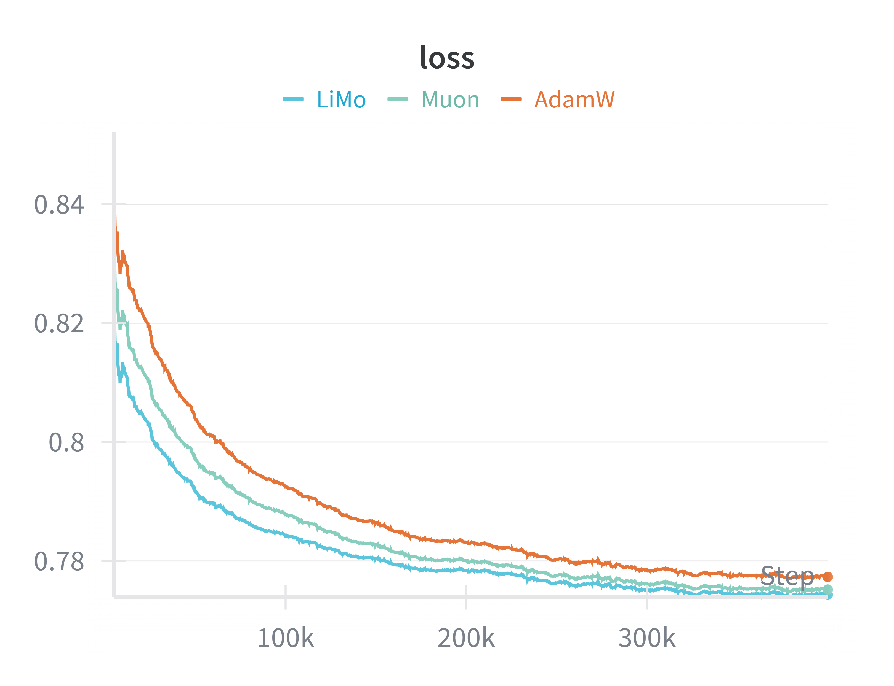 |

#### Learning-Rate Robustness

OLion retains an advantage over a wide range of learning rates (e.g., 3e-4 to 5e-3 on GPT-2 small):

<div align="center">
  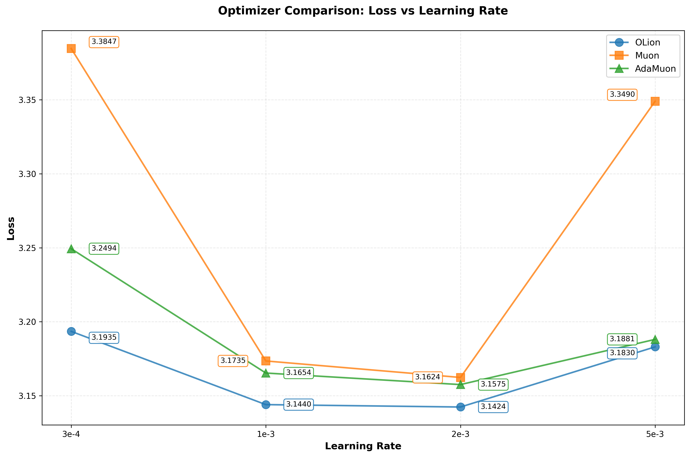
</div>

---

## Reproducibility

- **Paper**: [arXiv:2602.01105](https://arxiv.org/abs/2602.01105)
- **Code**: This repository (nanoGPT, Llama, SIT) with configs under each subdirectory.
- Figures in this README use paths under the `images/` directory (e.g., `images/geometry.png`, `images/spectral_1.png`). Place the figure files in an `images/` folder at the repo root (if they are currently in the parent directory, copy them into `images/` so the links work).

---

## Acknowledgements

Our training framework is built on [nanoGPT](https://github.com/karpathy/nanoGPT), [torchtitan](https://github.com/pytorch/torchtitan), and [REPA](https://github.com/sihyun-yu/REPA).

---

## Citation

```bibtex
@misc{wang2026olionapproachinghadamardideal,
      title={OLion: Approaching the Hadamard Ideal by Intersecting Spectral and $\ell_{\infty}$ Implicit Biases},
      author={Zixiao Wang and Yifei Shen and Huishuai Zhang},
      year={2026},
      eprint={2602.01105},
      archivePrefix={arXiv},
      primaryClass={cs.LG},
      url={https://arxiv.org/abs/2602.01105},
}
```
